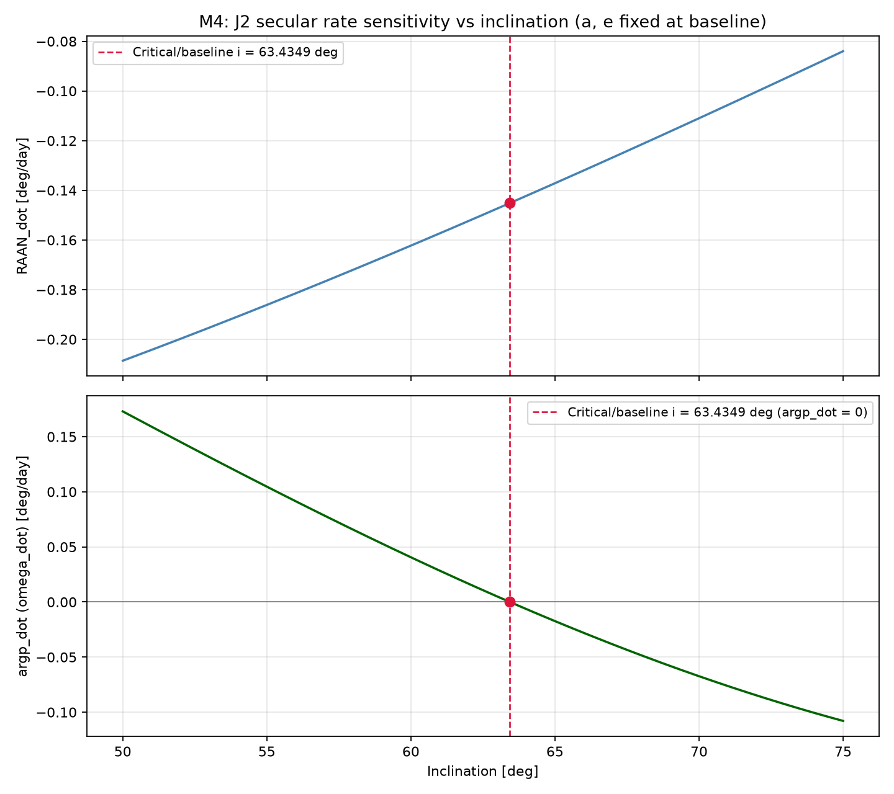
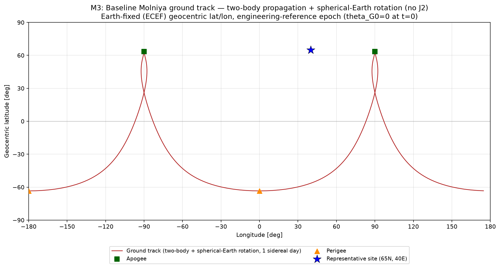
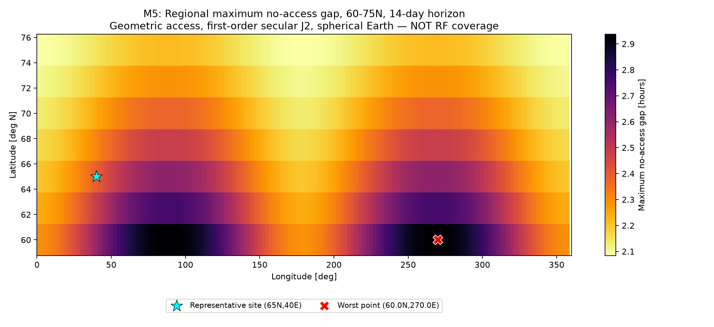
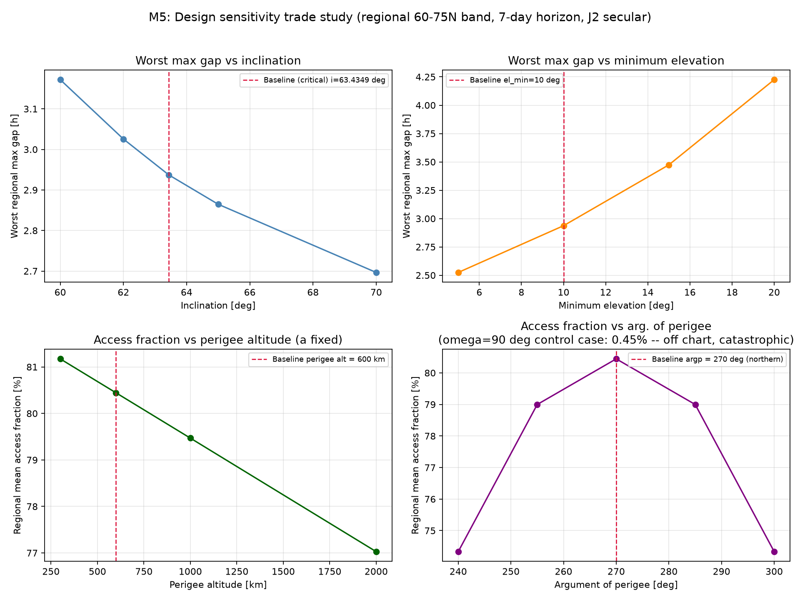

# Molniya Orbit Design

## Objective

Design and verify a single-satellite Molniya orbit for high-latitude
northern **geometric access** — deriving the baseline from physics
(not copied textbook elements), then numerically verifying every claim
through five independent milestones: two-body dynamics, Earth-fixed
ground track, first-order J2 perturbation, and a regional coverage/
revisit trade study.

## Final design

| Element | Value |
|---|---|
| Semi-major axis, a | 26561.762 km |
| Eccentricity, e | 0.7372864 |
| Inclination, i | 63.434949° (critical inclination) |
| Argument of perigee, ω | 270° (northern-apogee orientation) |
| RAAN, Ω | 0° (reference-epoch convention — see [Limitations](#limitations)) |
| Perigee altitude | 600 km |
| Apogee altitude | 39767.251 km |
| Period, T | 11.967235 h (≈ half sidereal day) |
| RAAN regression, Ω̇ | -0.145135 deg/day |
| Argument-of-perigee drift, ω̇ | ~0 (7.2×10⁻¹⁷ deg/day — critical inclination) |

Full derivation and justification: [`DESIGN.md`](DESIGN.md).

## Final service result

> **Single-satellite worst-case geometric no-access gap ≈ 2.94 hours**,
> over the 60–75°N service band, stable across 1–14 day horizons.
>
> **Regional mean geometric access ≈ 80%** (80.50% point-weighted /
> 80.24% area-weighted, 14-day horizon).
>
> **One spacecraft does not provide continuous coverage.** Even the best
> individual point in the service band (75°N, 0°E) has no access ~17%
> of the time.

These are **geometric access** results — spherical-Earth line-of-sight
above a 10° elevation mask, first-order secular J2 dynamics — not RF
link availability, not communications availability, not operational
uptime. See [Limitations](#limitations).

## Engineering progression

| Milestone | Scope | Status |
|---|---|---|
| M1 | Analytical design (half-sidereal-day period, critical inclination, northern apogee) + verification plan | ✅ |
| M2 | Two-body propagation verification: apsides, period, vis-viva, conservation, independent Kepler cross-check | ✅ |
| M3 | ECI/ECEF transformation, characteristic two-body ground track, single-site geometric access | ✅ |
| M4 | First-order secular J2: nodal regression, near-zero argp drift at critical inclination, sign reversal off-critical | ✅ |
| M5 | Regional high-latitude coverage/revisit engine + six-axis sensitivity study | ✅ |
| M6 | Independent final audit, repository hygiene, portfolio packaging, CI | ✅ |

Each milestone's full numeric results, verification tables, and any
genuine issues found (and how they were fixed) are documented in
[`DESIGN.md`](DESIGN.md) — nothing below is asserted without a
corresponding derivation or test in that document.

## Why critical inclination matters

The first-order secular argument-of-perigee rate is

    argp_dot = (3/4) J2 n (Re/p)^2 (5 cos^2(i) - 1)

which is exactly zero when `cos^2(i) = 1/5`, i.e. **i ≈ 63.4349°**. At
the baseline, this was verified to be zero to the double-precision floor
(7.2×10⁻¹⁷ deg/day) and confirmed to **change sign** on either side of
the critical value (positive below, negative above — see the figure
below). Practically: at critical inclination, argument of perigee stays
at 270° indefinitely, so apogee stays fixed over the northern service
band for the life of the mission with no inclination-change
stationkeeping. Off-critical, ω measurably drifts (e.g. −0.243° over 14
days at i=65°) — small at 14 days, but compounding over a multi-year
mission.

**This is a long-horizon orientation-stability benefit, not necessarily
a short-horizon access maximizer** — M5's inclination sensitivity study
found access fraction actually *improves* slightly toward i=70° over a
7-day horizon (higher apogee latitude helps more than the still-small
ω drift hurts at that timescale). The critical inclination's real value
is avoiding that drift compounding over years, not winning every
short-term access metric — see [`DESIGN.md` §M5.8](DESIGN.md#m58-inclination-sensitivity--a-genuine-non-obvious-finding).



## Ground track

The classical two-lobe Molniya ground track — two Earth-fixed loops
~180° apart in longitude, one revolution per lobe per sidereal day,
long high-latitude dwell at each apogee (slow angular motion there per
Kepler's second law):



## Coverage / revisit

The headline single-satellite result: maximum no-access gap across the
60–75°N band, 14-day horizon, first-order secular J2:



## Sensitivity

Four design axes, each independently swept over the regional 60–75°N
band (7-day horizon, J2 secular):



- **Minimum elevation** (5°/10°/15°/20°): strictly monotonic —
  higher threshold → less access, longer gaps. No reversal.
- **Inclination** (60°/62°/63.4349°/65°/70°): access *improves*
  monotonically toward 70° at this horizon (see "Why critical
  inclination matters" above) — the critical inclination is chosen for
  long-horizon stability, not short-horizon access maximization.
- **Argument of perigee**: 270° (baseline) is a clear local maximum,
  falling off symmetrically at ±15°/±30°. The **ω=90° southern-apogee
  control case fails catastrophically** — regional mean access collapses
  to 0.45%, and the worst grid point sees zero access for the entire
  7-day analysis window — confirming the northern-orientation
  implementation is correct.
- **Perigee altitude** (300/600/1000/2000 km, semi-major axis fixed):
  lower perigee → higher eccentricity → measurably more high-latitude
  access (confirmed by computation, not assumed), at the cost of the
  drag-safety margin the 600 km baseline was chosen for.
- **RAAN**: the full-longitude regional aggregate is invariant to 6
  decimal places under a RAAN rotation, while a fixed ground site's
  access fraction varies meaningfully (78.4%–81.4%) under the same
  rotation — cleanly separating a rotation-invariant regional property
  from a genuinely epoch/phase-dependent site property.

## Verification

Every physics claim in this project is backed by at least one, and often
two independent, numerical cross-checks:

- **Two-body conservation**: specific energy and angular momentum
  conserved to ~10⁻¹² relative (double-precision floor) over multiple
  orbital periods.
- **Vis-viva**: perigee/apogee speeds cross-checked against angular
  momentum (h = √(μp)) to 6+ significant figures.
- **Independent Kepler time-of-flight**: a from-scratch mean/eccentric-
  anomaly solver (not calling the numerical integrator) matches
  `solve_ivp` propagation to ≤6×10⁻¹³ relative error.
- **ECI/ECEF round-trip and right-handedness**: identity at θ=0, exact
  round trips, determinant = +1 confirmed for every rotation used.
- **Independent elevation geometry**: an Earth-center/site/satellite
  triangle-geometry elevation formula (no ENU basis, no dot products)
  agrees with the production ENU method to ≤6×10⁻¹² deg across every
  cross-checked point (representative site, worst regional point, and a
  band-edge point).
- **Independent Cartesian J2 cross-check**: a from-scratch osculating
  two-body-plus-J2 propagator, with RAAN/argp fitted from 7 days of
  perigee-sampled osculating elements, matches the first-order secular
  theory's RAAN_dot to 0.022% relative error — this is a **supporting
  cross-check only**, not the primary coverage-generating model (that
  remains the mean-element secular propagator).
- **Time and spatial-grid convergence**: every headline access/gap
  number was checked to converge monotonically as the sampling
  timestep (120→15 s) and regional grid (5°→1°) were refined; the
  worst-gap value is stable to <0.02% across a 5× resolution range.

Full residuals, tolerances, and methodology for every check above are in
[`DESIGN.md`](DESIGN.md), plus each milestone's own pre-flight
regression check that its predecessors' numbers hadn't drifted.

## Limitations

- Point-mass spacecraft; spherical Earth for all coverage geometry
  (geocentric, not geodetic/WGS-84, latitude/longitude)
- **First-order secular J2 only** — not a full/high-fidelity force
  model; the optional Cartesian J2 propagator is a supporting
  cross-check, not the primary model
- No drag, SRP, lunisolar perturbations, or stationkeeping design
- No RF link budget, antenna gain/pattern, or atmospheric/rain-loss
  modeling — results are **geometric access**, not communications
  availability
- No navigation/estimation errors, launch-injection-error analysis, or
  operational-availability claim
- No constellation sizing — **a classical operational Molniya
  communications system normally uses multiple spacecraft**
  (historically 2–3, ~8 hours apart); this project is explicitly a
  single-satellite geometric-access study and does not design, size, or
  optimize a constellation
- **No claim of continuous single-satellite coverage** — the ~2.94-hour
  worst-case gap is this project's headline result, not a caveat

This is a single-satellite geometric-access study. It does **not**
establish a complete operational Molniya communications system — a real
system would additionally need multiple satellites, an RF link budget,
stationkeeping, more complete perturbation modeling, and an operations/
availability analysis. Full limitations list: [`DESIGN.md` §11](DESIGN.md#11-limitations),
extended per-milestone throughout the document.

## Reproducibility

```bash
git clone https://github.com/Sanjanakamboj/molniya-orbit-design.git
cd molniya-orbit-design
python3 -m venv .venv && source .venv/bin/activate
pip install -e ".[dev]"
pytest -W error                              # 117 tests, zero warnings

# regenerate numeric verification reports
python scripts/m2_verification_report.py
python scripts/m3_verification_report.py
python scripts/m4_verification_report.py
python scripts/m5_verification_report.py     # also writes results/*.json, *.csv

# regenerate all figures
python scripts/m2_figures.py
python scripts/m3_figures.py
python scripts/m4_figures.py
python scripts/m5_figures.py
```

All numeric outputs above were verified deterministic (byte-identical or
numerically identical) across independent runs, including in a genuinely
fresh virtual environment created from scratch at the final audit —
see [`DESIGN.md` §M6.9](DESIGN.md#m69-fresh-environment-reproducibility).
CI (GitHub Actions, `.github/workflows/tests.yml`) runs the test suite on
every push/PR against Python 3.11 and 3.12.

## Repository structure

```
DESIGN.md               full technical narrative: derivation,
                         verification, and results for all 6 milestones
README.md               this file
LICENSE                 MIT
pyproject.toml           package metadata and dependencies
src/molniya_design/     constants, elements, twobody, propagation,
                         frames, groundtrack, access, j2, j2_cartesian,
                         coverage
tests/                  pytest suite (117 tests across 5 files)
scripts/                verification-report and figure-generation scripts
figures/                12 figures (M2-M5); see DESIGN.md §M6.10 for the
                         primary/supporting hierarchy
results/                machine-readable verification reports (M2-M4)
                         and JSON/CSV results (M5)
.github/workflows/      CI (pytest on Python 3.11 and 3.12)
```

## What this project demonstrates

- **Analytical orbital design**: deriving a, e, i from physical
  requirements (half-sidereal-day period, practical perigee altitude,
  the critical-inclination condition) rather than copying published
  Molniya elements, with every design choice traced to a closed-form
  derivation.
- **Verification discipline**: two-body dynamics, frame transformations,
  and perturbation rates each checked against at least one independent
  method (analytical Kepler solve, triangle-geometry elevation,
  osculating Cartesian propagation) rather than only self-consistency
  within one code path; every milestone re-verified its predecessors'
  numbers before adding new results.
- **Perturbation interpretation**: distinguishing a first-order secular
  model from a full force model, a mean-element result from an
  osculating one, and a short-horizon access metric from a long-horizon
  orbital-stability property — and reporting a genuinely
  counter-intuitive finding (critical inclination doesn't maximize
  short-horizon access) rather than smoothing it into the expected
  narrative.
- **Coverage/revisit trade reasoning**: separating an orbit-geometry
  dwell proxy, a single-site access fraction, and a regional aggregate
  access metric as three distinct, non-interchangeable quantities;
  quantifying (not asserting) a single-satellite system's real
  limitation; and stating that limitation as the headline result.
